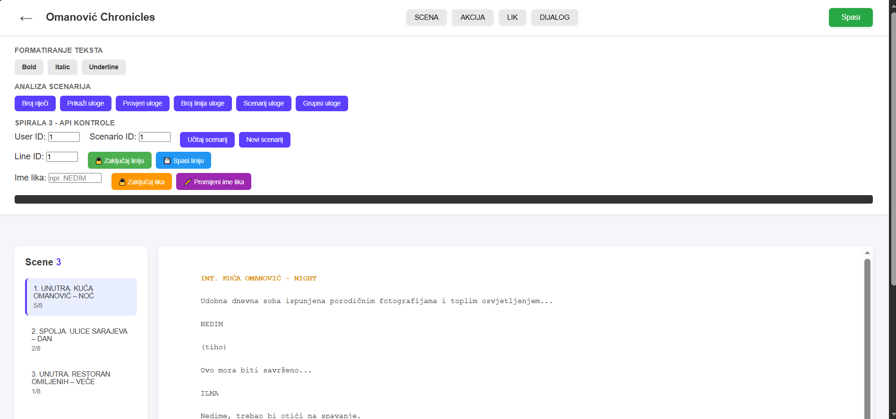

# Web Application Project

## Links
- Original repository: [Bitbucket Repo](https://bitbucket.org/nomanovci3/wt26p19655/src/main/)
- Home screen screenshot:

  

A web application developed using HTML, CSS and JavaScript with SQL database integration and REST API communication.  
The project demonstrates frontend development, data fetching and database interaction.

## Features
- Dynamic web interface
- REST API integration
- Data fetching and display
- SQL database usage
- Responsive design

## Tech Stack
- HTML5
- CSS3
- JavaScript (ES6)
- SQL Database
- REST API

## What I Learned
- Building interactive web pages
- Working with REST APIs using JavaScript
- Handling asynchronous requests (fetch/async-await)
- Connecting web applications with databases
- Structuring frontend projects
